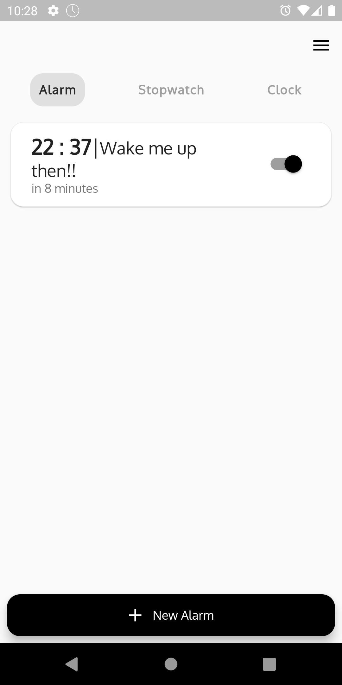
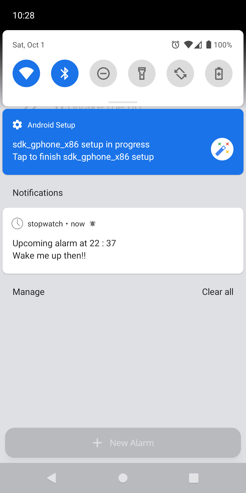
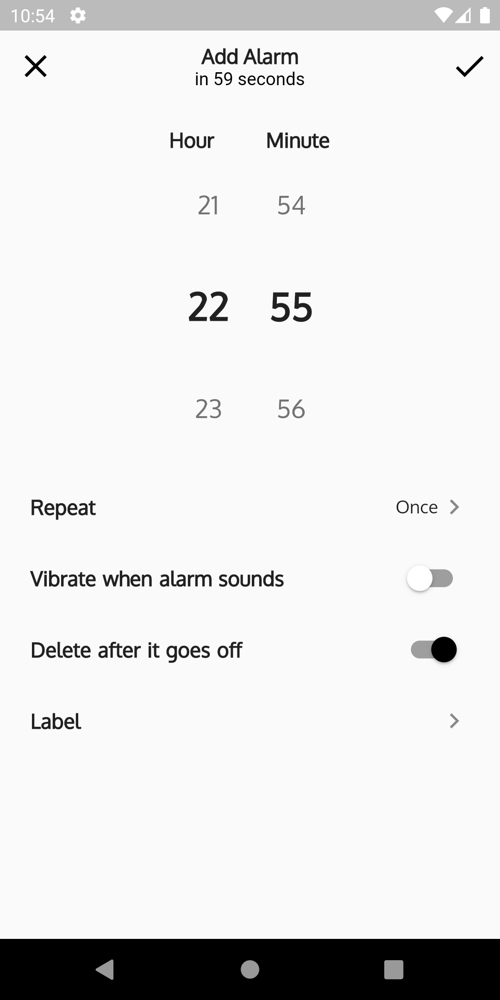
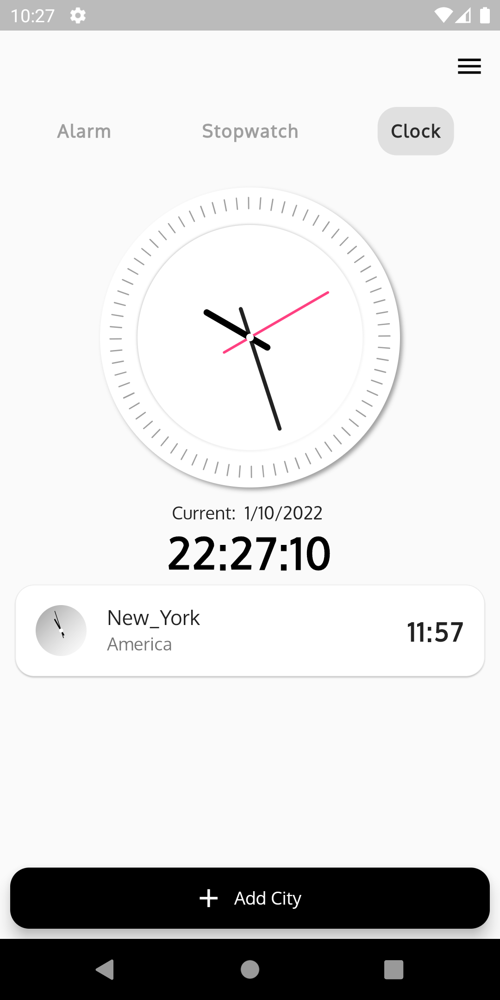
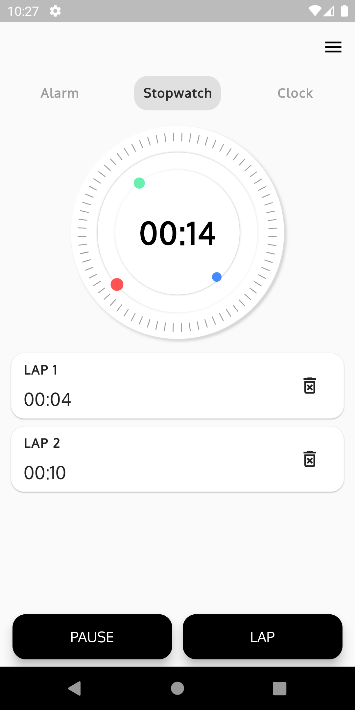

# :clock10: ClockWork

A basic clock app, with all the main features like `alarms`,`stopwatch` and `clock` as available natively in a smartphone.

## :construction_worker: Description

The clock app in our phone is a very interesting one, it has `alarms`, `stopwatch `,`timmer`,`clock (obiously 😀)`.Implementing them togerther was fun ,and here are the results that I came forward with.

#### :alarm_clock: Alarm Clock

<div align="center">
  
  
  
</div>

The alarm clock which can be used obiously to create `alarms`.This sub app consists of 2 parts creating an

- **Show Alarms**
  The alarms will be shown here with a option to turn off the alrms

- **Creating Alarms**
  Now we will create an alarm , An alarm can have 4 arguments, The argumets are self `explanitory`.
  - [x] Daily or Once
  - [x] Alarm Label _Notification Title_
  - [x] Vibrate
  - [x] Delete after turned off
- **Alarms**
  For the alarms we take help of which gives us the ability to run `Isolates` in background, and paired up with `flutter_local_notifications` and `flutter_vibrate` helps to create a perfect alarm.

```yaml
android_alarm_manager_plus: ^2.0.5
flutter_local_notifications: ^9.7.0
flutter_vibrate: ^1.3.0
```

###### How to use Alarm manager

As it's the most difficult topic in this project, so it's good to share some snippets

<details><summary><b>One shot Alarm</b></summary>
This alarm will be assigned only once in the given

```dart
  DateTime dateTime
```

```dart
  await AndroidAlarmManager.oneShotAt(
    datetime,
    alarm_id,
    (){
      // A function inplementing the background call
    },
    alarmClock: true,
    wakeup: true,
    exact: true);
```

</details>

<details><summary><b>Periodic Alarms</b></summary>
This alarm will be assigned periodically

```dart
  DateTime dateTime
```

```dart
 await AndroidAlarmManager.periodic(
    const Duration(days: 1), // periodic range
        0, // alarmID
        (){
          // A function implementing the background call
        },
        startAt: dateTime, // After what time to start the periodic call
        wakeup: true,
        exact: true,
      );
```

</details>

#### 🕰️ Clock

<div align="center">
  
  
</div>

There is no clock app without a clock itself 😆. Thus I made a simple `analog clock`, which shows the current time. **Simple right**. But the cache is 🤟`you` can add multiple timezones which shows there's time.

**Timezone**
The timezone data is being taken from [http://worldtimeapi.org/](http://worldtimeapi.org/)

<details><summary><b>Schema for the api </b></summary>

```bash
   curl "http://worldtimeapi.org/api/timezone/Asia/Kolkata"
```

```json
{
  "abbreviation": "IST",
  "client_ip": "202.78.234.207",
  "datetime": "2022-10-01T23:42:19.812452+05:30",
  "day_of_week": 6,
  "day_of_year": 274,
  "dst": false,
  "dst_from": null,
  "dst_offset": 0,
  "dst_until": null,
  "raw_offset": 19800,
  "timezone": "Asia/Kolkata",
  "unixtime": 1664647939,
  "utc_datetime": "2022-10-01T18:12:19.812452+00:00",
  "utc_offset": "+05:30",
  "week_number": 39
}
```

</details>

The timezone data is then `cached` to the localstorage with `hive`.So that there is just a single api call , then the data can be loaded from the database.

#### ⏱ Stopwatch

<div align="center">
  
</div>

This sub app is a `simple stopwatch` with the functionality to create laps. ⚠️ These laps are not be saved in a database, but the laps are persistance in the app lifecycle.

## ♻️ Run this app

To contribute to this project follow the instructions

```bash
  git clone https://github.com/tuuhin/clockwork
  cd clockwork
```

Adding dependencies

```bash
  flutter pub get
  flutter pub run build_runner build
```

Run the project

```bash
  flutter run
```

## :end: Conclusion

Its a basic all in one clock app , the stopwatch and clock works well , there is some `bugs` associated with it, mainly the the alarm clock part but I am ending the project here, as it meets most of the requirements of a clock app
